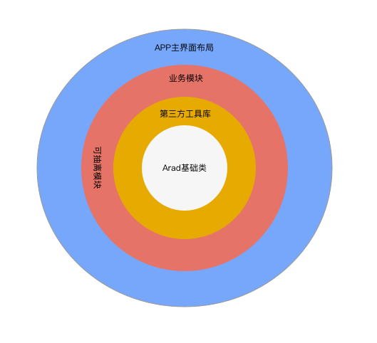

# smart-farmer-android
整合常用的业务模块，快速开发项目

本项目基于组件化开发的思想，GUI层使用MVP框架以及整合最新的android开发技术，包括但不限于（Retrofit Rxjava OKhttp Glide LiteOrm......）,持续更新!

===
###架构图

**1.第一层** [Arad基础类库](https://github.com/beanu/Arad)
- Retrofit
- Rxjava
- Okhttp
- Glide
- LiteOrm
- avtivity fragment adapter基础类
- 上拉下拉基础Adapter，常用的util等

**2.第二层** 可依赖的第三方功能库(特点：可单独使用的工具型模块)
- [图片选择器](l2_imageselector)
- [二维码扫描](l2_zxing)
- [支付宝＋微信支付](l2_pay)
- [推送（小米，华为，极光）](l2_push)
- [分享／第三方登录](l2_shareutil)
- [聊天IM](l2_im)
- [RecycleView 各种用法](l2_recycleview)

**3.第三层** 业务模块＋可抽离并可复用的模块
- [登陆模块](l3_login)
- 新闻模块
- 个人中心
- 设置中心
- 商品详情
- [购物车](l3_shoppingcart)
- 订单模块
- [引导页](l3_guide)
- *单列表页*
- *带有分类表头的列表页*
- *九宫格*
- *地图展示*
- *首页*
......

**4.第四层** 主APP布局
- [底部导航](l4_bottom_tab)
- [侧滑](l4_drawer_navigation)
- [空工程](l4_clean)

###效果图

###Android Studio插件
- [Android ButterKnife Zelezny](https://github.com/avast/android-butterknife-zelezny) findViewById的代替品
- [MVPHelper](https://github.com/beanu/mvphelper) 帮助生成MVP的接口和类
- [Android Parcelable code generator](https://github.com/mcharmas/android-parcelable-intellij-plugin) 可序列化生成器

###参考文章

- [关于Android业务组件化的一些思考](http://zjutkz.net/2016/10/07/%E5%85%B3%E4%BA%8EAndroid%E4%B8%9A%E5%8A%A1%E7%BB%84%E4%BB%B6%E5%8C%96%E7%9A%84%E4%B8%80%E4%BA%9B%E6%80%9D%E8%80%83/)
- [Android组件化实战](http://www.jianshu.com/p/4a5a036111bd)
- [Android 开发:由模块化到组件化](http://blog.csdn.net/dd864140130/article/details/53645290)

